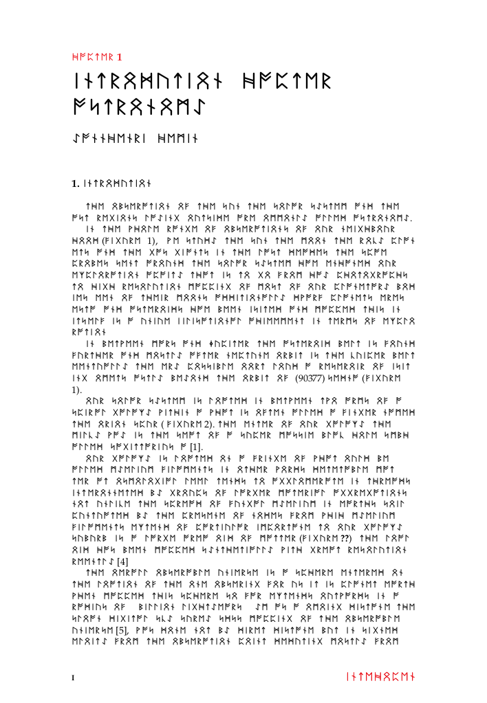
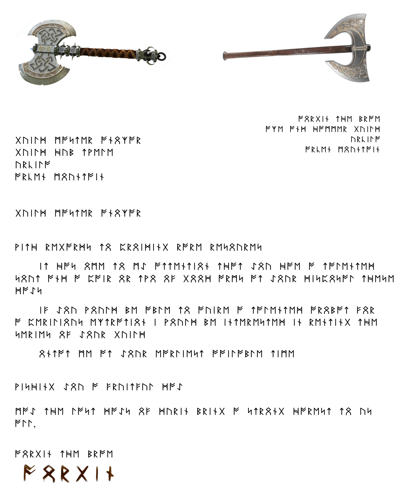

# DND DWARVEN SCROLLS
A set of DND Dwarven bills/invoices/other administrative docs in runic alphabet in LaTex, to be printed on yellowish paper.

It is written in English, but with a RUNIC font (\usepackage{runic} and \textfut{AORGIN THE BRAVE AND THE MERRY MINERS})

## A bill (in 2023_Dwarven_Bills/):

The signature is a screenshot of \textfut{AORGIN} in the pdf, processed in GIMP:

- Filters/Decor/Old Photo
- Filters/Map/Warp
- Fuzzy Tool with a larger Threshold to select all non-font and set them to pure white 

## An Astronomy Book (in 2023_Dwarven_AstroBook):

It is actually a real publication of mine summarizing what is known as of today in Astronomy, so it is certainly a very arcane book for a medieval-fantasy setting... It is 8 pages, all in runic characters, with figures, references, etc.

## An Official Letter

